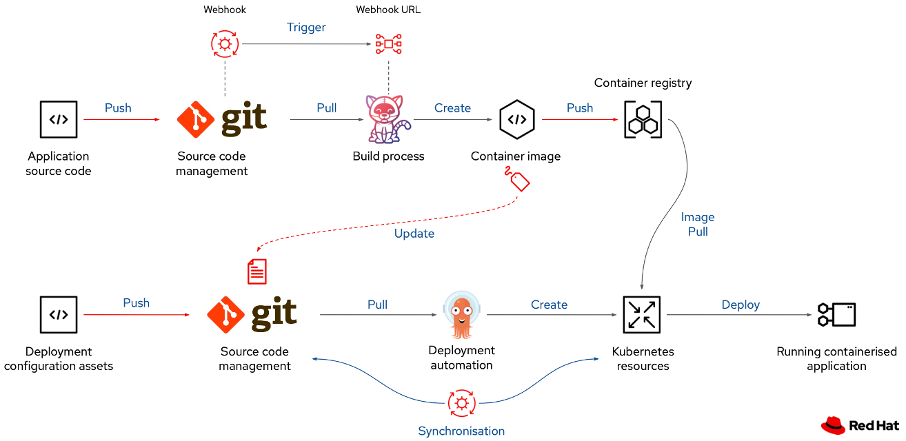

# ocp-example-node-app

This is a simple Hello World app which uses Node.js.

It is supposed to be deployed on the OpenShift container platform.

The app's container image is built in an automatically triggered pipeline and the manifest files are automatically deployed by ArgoCD.



The above diagram shows the intended CI/CD workflow for this example app. (Keep in mind that in this case the "Application source code" and "Deployment configuration assets" are in the same repo)

The "Deployment configuration assets" (Kubernetes manifests) are in the `/manifests` directory. It has the following simplified Kustomize structure:

```
manifests/
├── base ➀
└── overlays ➁
    ├── dev ➂
    │   ├── active
    │   ├── common
    │   └── passive
    └── prod
        ├── active
        ├── common
        └── passive
```
➀ The `base` directory contains resources which exist across all environments. (e.g. deployment.yaml)

➁ There is an overlay per environment (dev, prod, etc.) Using these overlays, you can apply different resources depending on the environment. E.g. in this example setup, the build pipeline is only in the dev environment.

➂ Inside a environment folder, there is an additional level of differentiation. It is for the active and passive site.

## How to deploy on dev

Just push a new commit, the build pipeline will be triggered, and it will be automatically deployed on dev.

## How to deploy on prod

Firstly, trigger a new image build by creating and pushing a git tag:

```bash
git tag <new-tag>
git push origin <new-tag>
```

This will start the pipeline and a new image will be built using the git tag as its image tag. (The commit message of the commit which you tagged is not allowed to be from the pipeline, since that trigger will be ignored by the pipeline)

In order to deploy the newly built image on prod, update `images.newTag` in `manifests/overlays/prod/common/kustomization.yaml` to be your newly created tag.

## Note

Be carefull to always pull the latest changes first before creating new commits. Be aware that the `update-image-tag` step in the pipeline creates a new commit every time the pipeline runs.
